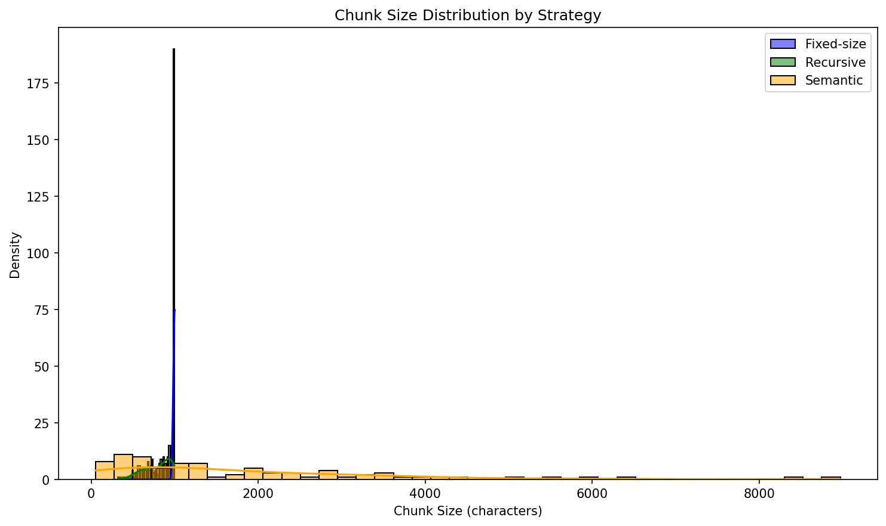

# Zen RAG Pipeline

A small benchmark that compares three document chunking strategies for retrieval-augmented generation (RAG). It runs the same pipeline—embed, store, retrieve, generate—on Paul Graham essays and scores each strategy on retrieval accuracy and answer quality.

## What it does

1. Loads essays from `data/essays/`
2. Chunks them with **fixed-size**, **recursive**, or **semantic** splitters
3. Embeds chunks with OpenAI `text-embedding-3-small` and stores them in separate ChromaDB collections
4. Runs five hand-written queries (factual, multi-hop, negation, comparison, summarisation)
5. Retrieves top-3 chunks, generates answers with `gpt-4o-mini`, and evaluates results

Outputs land in `results/`:

| File | Description |
|------|-------------|
| `comparison.csv` | Metrics per strategy (from `main.py`) |
| `comparison_table.md` | Formatted table (from `visualize.py`) |
| `chunk_size_distribution.png` | Chunk size histogram (from `visualize.py`) |

## Approach

All strategies share the same embedding model, retriever (`TOP_K=3`), and generator so differences come from chunking alone.

| Strategy | How it splits |
|----------|----------------|
| **Fixed-size** | Fixed character windows with overlap |
| **Recursive** | LangChain recursive splitter (respects paragraphs/sentences) |
| **Semantic** | Embedding-based breakpoints at topic shifts |

**Retrieval metric:** Precision@3 against labeled `relevant_doc_ids` in `queries.py`.

**Generation metrics:** Faithfulness (answer grounded in context) and answer relevancy (answer matches the question), scored via LLM judges in `src/evaluator.py`.

Chunking knobs live in `config.py` (chunk size, overlap, semantic threshold, models, paths).

## Setup

**Requirements:** Python 3.10+, an [OpenAI API key](https://platform.openai.com/api-keys) (embeddings, generation, and semantic chunking all use it).

```bash
# Option A: use the setup script
chmod +x setup.sh && ./setup.sh

# Option B: manual
python3 -m venv venv
source venv/bin/activate   # Windows: venv\Scripts\activate
pip install -r requirements.txt
cp .env.example .env
```

Edit `.env` and set your key:

```
OPENAI_API_KEY=sk-...
```

## Run & test

**1. Run the full comparison** (chunking + indexing + retrieval + generation + evaluation). Expect several minutes and API cost.

```bash
source venv/bin/activate
python main.py
```

You should see a summary table in the terminal and `results/comparison.csv`.

**2. Generate charts and a markdown table** (run after `main.py` so `comparison.csv` exists):

```bash
python visualize.py
```

**3. Sanity-check without a full run**

- Confirm essays exist: `ls data/essays/*.txt` (five Paul Graham essays).
- Inspect queries and ground truth: `queries.py`.
- Tune chunking/models: `config.py`.

## Results

After `main.py` and `visualize.py`, check `results/comparison.csv`. On a representative run across five Paul Graham essay queries:

- **Semantic** had the best retrieval (Precision@3 ~0.47) with the fewest chunks (~92) and the largest average chunk size (~1,650 chars). Faithfulness and answer relevancy (~0.6 / ~0.8) matched recursive.
- **Recursive** sat in the middle on retrieval (~0.33) with similar answer quality to semantic, but nearly twice as many chunks as semantic.
- **Fixed-size** lagged on every generation metric (faithfulness ~0.3, relevancy ~0.6) and retrieval (~0.2). Splitting mid-sentence hurt both embedding quality and what the model could use as context.

Semantic chunking is the practical pick here: better precision with less index to store. Recursive is a reasonable fallback if you want structure-aware splits without extra embedding calls at ingest. Fixed-size is fine for a baseline, not for production on long prose.

### Chunk size distribution

The histogram below overlays how many characters each strategy produces per chunk across all essays. Fixed-size clusters tightly around the configured window (~1,000 chars). Recursive spreads slightly lower on average because it breaks on natural boundaries. Semantic pushes mass toward larger chunks—fewer splits, more complete thoughts per vector.



Higher **precision@3** means the top-3 retrieved chunks hit your labeled relevant IDs. Higher **faithfulness** / **answer relevancy** means the generated answer stays grounded and on-topic. Scores vary by run and API stochasticity in the LLM judges.

## Project layout

```text
main.py           # End-to-end benchmark
visualize.py      # Plots + markdown table
config.py         # Hyperparameters and paths
queries.py        # Test queries + ground truth
src/
  chunkers/       # fixed_size, recursive, semantic
  data_loader.py  # Load essays
  embedder.py     # OpenAI embeddings
  store.py        # ChromaDB
  retriever.py    # Vector search
  generator.py    # Answer generation
  evaluator.py    # Metrics
data/essays/      # Source documents
results/          # Outputs (gitignored except samples if present)
```

## Notes

- Chroma data is persisted under `./chroma_db/`; delete it to re-index from scratch.
- Semantic chunking calls the embeddings API during indexing, not only at query time.
- `results/deployment_recommendation.md` is an example write-up from a past run, not generated by `main.py`.
